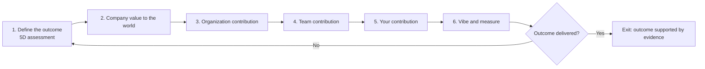

# Close the Loop

**Coding is now about converting tokens to outcomes.**

Based on Anirudh Badam's “Make Coding Hard Again: Close the Loop” edition of *The AI Unconspiracy*.

Use this checklist to connect the agent you build to a measurable outcome in the world. Start with that outcome, work backward through company, organization, team, and your contribution, then vibe and measure. Repeat until the intended outcome is delivered.

Building the context is part of the engineering work. Without customer conversations, stakeholder meetings, original writing, design documents, and the effort to rally people around a change, you can spend months improving an agent that solves the wrong problem. Working code alone does not establish that you converted tokens into value.

## How the three checklists work together

- **Phase 1 requires, at minimum, a completed assessment using [The 5D Test](5d_test.md).** Review all five Ds and the developer's own position. Use the findings to define or revise the outcome.
- **Every phase after that, phases 2–6, requires its own application of [Only yoU can beat AI](only_you.md).** Review Read more, Write more, Meet more, Talk more, and the originality check against that phase's work. A single project-wide review does not replace the five phase-specific reviews.
- Link each assessment to its supporting material and to the decision, specification, or agent behavior that material shaped. The same source can support several phases when you explain its distinct use in each.
- Mark missing evidence **Unknown**, with an owner and a next action. A completed assessment can contain gaps; it is not automatically a Pass. At the planning stage, unobserved delivery remains Unknown. Revisit it after the experiment.
- Preserve the companion checklists' evidence standards. Prompts alone do not count as original writing. A conversation with AI does not count as talking with people. Distinguish actual in-person encounters from live remote discussions. Never invent stakeholders, meetings, transcripts, opinions, or outcomes.

**Agent or project:**  
**Developer / team / organization / company:**  
**Outcome owner:**  
**Reviewer and date:**  
**Iteration:**  

If these organizational levels share the same people, record that explicitly. Still examine each contribution; do not invent a hierarchy.

## The loop

**Apply Only You in every phase from 2 through 6.** At each contribution, do the talking, reading, writing, meeting, presenting, and iterating needed to vet it. Prod, nudge, and rally the people whose participation makes the outcome possible.

## 1. Define the outcome

**Required companion: [5d_test.md](5d_test.md).**

- [ ] Complete the 5D assessment: Disruptor, Delivering, Disintermediation, Deflation, and Diversification, plus the developer's own position.
- [ ] Use that assessment to state what should change, for whom, and why it matters. Name the agent's proposed contribution and the developer's or company's short-term benefit.
- [ ] Record the baseline, target, measurement method, observation period, and person responsible for judging the result.
- [ ] Separate an outcome from an artifact. “Ship an agent” is an activity; a specified improvement in customer activation, useful adoption, cost, or another real-world result can be an outcome.
- [ ] Record the assumptions and missing evidence the experiment must test.

The 5D test looks for **Disruptor + Delivering + at least one of Disintermediation, Deflation, or Diversification**, supported by evidence. Before delivery, state the hypothesis and leave unsupported items unchecked. Do not claim a future benefit as an observed result or manufacture a Pass to begin experimenting.

**Outcome statement:** For [people], change [measure] from [baseline] to [target] over [period], because [value].  
**5D assessment link and result:**  
**Known evidence, assumptions, and next validation:**  

## 2. Connect the outcome to company value in the world

**Required companion: a phase-specific [only_you.md](only_you.md) review.**

- [ ] Explain how the intended outcome helps the company deliver value to customers or the world.
- [ ] Talk to a few customers or C-suite leaders to vet that connection. Record who participated and what they confirmed, challenged, or changed.
- [ ] Write your interpretation for another person. Distinguish customer need, company priorities, and your own assumptions.
- [ ] Revise the outcome or value claim when the evidence calls for it. Identify who must support adoption or a change in how the company serves customers.
- [ ] Complete this phase's Only You review and show how the material changes the proposed agent or experiment.

**Company value claim and stakeholder evidence:**  
**Original writing, feedback, and resulting decision:**  
**Only You review link, result, and unresolved gaps:**  

## 3. Establish the organization's contribution

**Required companion: a phase-specific [only_you.md](only_you.md) review.**

- [ ] Explain how the organization as a whole typically delivers solutions that drive outcomes like this.
- [ ] Talk to a few VPs or the people accountable for those organizational capabilities to vet your understanding.
- [ ] Identify the existing processes, systems, dependencies, and constraints the solution must work with or change.
- [ ] Write a design note or proposal, present it, and revise it in response to disagreement. Identify the commitments needed across teams.
- [ ] Complete this phase's Only You review and link its findings to the solution design.

**Organization's contribution and stakeholder evidence:**  
**Design note, dependencies, commitments, and revisions:**  
**Only You review link, result, and unresolved gaps:**  

## 4. Establish the team's contribution

**Required companion: a phase-specific [only_you.md](only_you.md) review.**

- [ ] Explain how the team typically contributes to agents that deliver solutions like the one described above.
- [ ] Talk to team leaders and peers. Vet the proposed responsibilities against their experience of how the work actually happens.
- [ ] Identify what the team owns, what it depends on, and who will use, review, or operate the agent.
- [ ] Write or revise the team-level design. Present it, resolve disagreements, and rally the people needed to put the change into practice.
- [ ] Complete this phase's Only You review and show how the conversations and writing alter the plan.

**Team contribution and stakeholder evidence:**  
**Team design, ownership, adoption commitments, and revisions:**  
**Only You review link, result, and unresolved gaps:**  

## 5. Establish your contribution

**Required companion: a phase-specific [only_you.md](only_you.md) review.**

- [ ] State how you contribute to building the agent the team needs, using your own experience and judgment.
- [ ] Review relevant original sources, write your reasoning for colleagues, and test it in discussion with the people affected.
- [ ] Turn the accumulated context into a specification: inputs, expected behavior, constraints, acceptance criteria, and the experiment that tests the outcome.
- [ ] Link requirements to the earlier stakeholder evidence. Show where that context enters the agent's instructions, tools, data, evaluations, or workflow.
- [ ] Complete this phase's Only You review. Explain what would be missing from the agent without your contribution.

**Your contribution and original material:**  
**Specification, experiment, and links to stakeholder evidence:**  
**Only You review link, result, and unresolved gaps:**  

## 6. Vibe and measure

**Required companion: a phase-specific [only_you.md](only_you.md) review.**

- [ ] Use the accumulated context to build the agent and put the experiment into real use.
- [ ] Check technical correctness and observe whether intended users actually adopt the workflow.
- [ ] Measure the outcome against the baseline, target, and observation period from phase 1. Include token, operating, and human effort costs where they affect the value claim.
- [ ] Talk to users and the outcome owner about what happened. Write an interpretation that separates measured results from assumptions, other influences, and unresolved questions.
- [ ] Complete this phase's Only You review using real observations, original analysis, and feedback. Show how these shape the next revision or the decision to close the loop.
- [ ] Revisit the 5D assessment with the delivery and outcome evidence now available.

For example, generating onboarding documents in thirty seconds instead of two hours may be a technical success. If the intended outcome was faster customer activation, measure activation. Document generation speed alone does not establish that outcome.

**Implemented agent, actual use, and observed results:**  
**Costs, feedback, interpretation, and revised 5D assessment:**  
**Only You review link, result, and unresolved gaps:**  

## Close or repeat

- [ ] **Outcome delivered — exit.** Evidence meets the agreed outcome criteria, the outcome owner has reviewed the result, and the phase assessments and their material gaps are recorded. State what value the agent actually created.
- [ ] **Outcome not delivered — repeat.** Identify the broken assumption or contribution link. Return to phase 1 with what you learned, revise the plan, and repeat the affected stakeholder work and companion reviews.
- [ ] **Unknown — keep the loop open.** Measurement, adoption, or evidence is insufficient. Name what must be observed next, who will obtain it, and when.

An unmet outcome is a failed experiment against that target, even if the code works. Learning is useful evidence for the next iteration; it does not turn a missed target into delivery. If you change the outcome or target, record the reason and keep the previous result visible.

Stopping or canceling a project is not the same as closing the loop successfully. Record it as stopped without the intended outcome.

**Decision and evidence:**  
**What we learned / what changes next:**  
**Owner and next review date:**  

## Source context

Adapted from Anirudh Badam's “Make Coding Hard Again: Close the Loop” framework. The loop builds on the existing [5D Test](5d_test.md) and [Only yoU can beat AI](only_you.md) checklists. Its purpose is to connect human context and agent implementation to verified outcomes.

